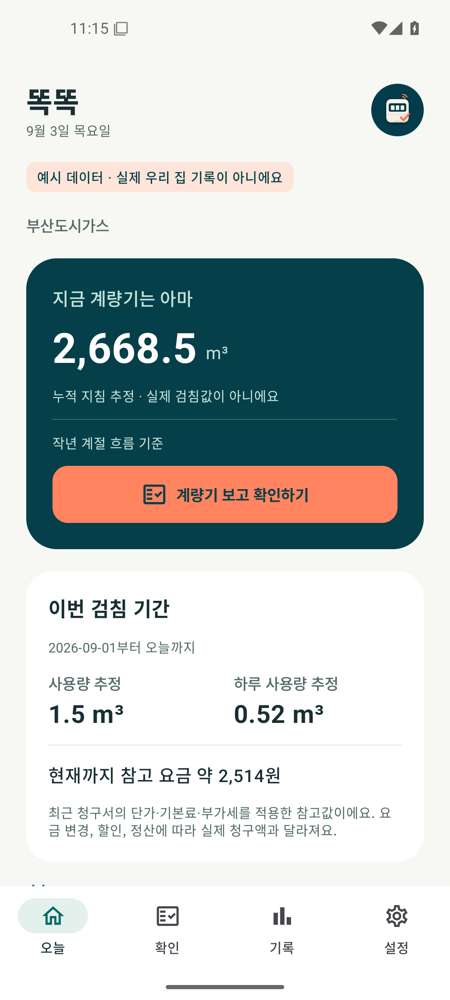
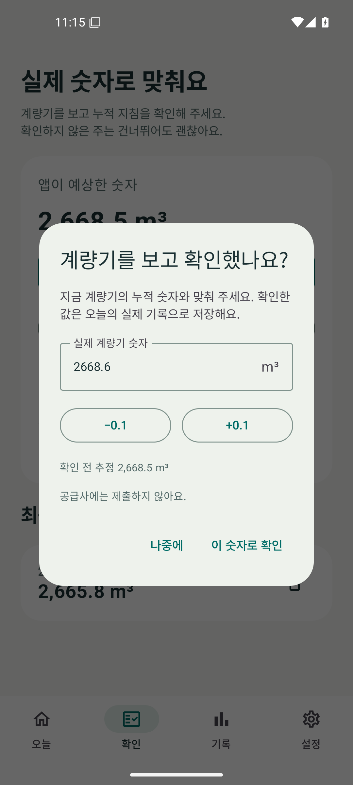

<p align="center"></p>

# 똑똑 자가검침 AI

**일주일에 한 번, 우리 집 가스를 알아가요.**

센서와 Home Assistant 없이 사용하는 Android 도시가스 기록 앱입니다. 작년 같은 달과 앞뒤 달의 사용 흐름에 최근 실제 계량기 확인값을 반영해 오늘의 누적 지침을 추정합니다.

[첫 APK 다운로드](https://github.com/mahlernim/gas-self-meter-ai/releases/latest) · [공급사 조사](docs/PROVIDERS.md) · [개인정보 안내](PRIVACY.md) · [추정 방법](docs/ESTIMATION.md)

## 첫 버전에서 할 수 있는 일

- 지역과 공급사를 선택하고 시작하기
- 부산도시가스 계정으로 계약, 과거 청구서와 검침 예정일 조회
- 다른 지역은 청구서의 실제 사용 기간과 사용량 직접 입력
- `맞음`, `+0.1`, `−0.1`, `직접입력`으로 계량기 숫자를 조절한 뒤 실제 확인값 저장
- 작년 계절 흐름과 최근 실측을 활용한 누적 지침, 하루 사용량 추정
- 지침이 있는 청구 이력으로 이번 검침 기간 사용량과 참고 요금 확인
- 사용 흐름, 확인 전 추정과 실제 숫자의 차이, 이전 기록 확인
- 주간 알림, 계량기 교체, 백업 내보내기와 복원, 데이터 삭제
- 가상 데이터로 계정 없이 둘러보기

Android 8.0 이상에서 사용할 수 있습니다. 첫 버전은 한 기기에 한 가구를 관리합니다. 다른 가구로 바꾸기 전 기록을 내보낸 뒤 초기화해 주세요.

## 연결 범위

| 공급사 | v0.1.0 |
| --- | --- |
| 부산도시가스 | 계정 로그인과 청구 이력 자동 조회 |
| 다른 SK E&S 지역 공급사 | 직접 입력. 공개 로그인 구현의 공통점만 확인 |
| 서울도시가스, 예스코, 인천도시가스 등 가스앱 공급사 | 직접 입력. 가스앱 참고 코드를 조사했으며 자동 연결은 미지원 |
| 그 밖의 공급사 | 직접 입력 |

공급사 이름이 목록에 있다는 뜻은 자동 연결을 지원한다는 뜻이 아닙니다. 같은 시·도 안에서도 주소에 따라 공급사가 다릅니다. 청구서의 공급사 이름을 확인해 주세요. 목록에 없으면 `다른 공급사 / 직접 입력`을 선택할 수 있습니다.

부산 이력 조회는 허가받은 계정으로 읽기 전용 검증을 수행했습니다. 검증한 계정의 결과가 모든 계약에서의 동작을 보장하지는 않습니다. 공급사 사이트가 변경되면 연결 업데이트가 필요할 수 있습니다.

## 화면

스크린샷은 앱에서 생성한 가상 데이터입니다. 실제 고객 정보가 아닙니다.

<p>




</p>

## 확인과 추정

`맞음`도 계량기를 실제로 본 뒤 눌러 주세요. 버튼을 누르는 것만으로 새로운 측정 정보가 생기지는 않습니다. 숫자를 조절한 후 `이 숫자로 확인`을 눌렀을 때 실측 하나로 저장합니다. 짧은 시간 안에 다시 고치면 중복 실측 대신 기존 확인을 수정합니다.

작년 이력이 없다면 최소 하루 간격의 실제 확인 두 번이 필요합니다. 주 1회 확인을 권장합니다. 데이터가 부족하거나 오래되면 추정 숫자를 숨기고 안내합니다. ±0.1 m³는 입력 조절 단위이며 정확도 보장이 아닙니다.

참고 요금은 최근 청구서의 단가와 기본료에 바탕을 둡니다. 새로운 단가, 할인, 정산, 실제 발열량 변화가 반영된 확정 청구액이 아닙니다. 사용량과 누적 지침을 구분해서 표시합니다.

## 개인정보

계정과 생활 기록은 Android Keystore로 보호되는 키를 사용해 기기에 암호화해 저장합니다. 부산 연결 시 기기에서 공급사 HTTPS 서버로 직접 로그인하고 조회합니다. 개발자 서버, 광고, 분석 SDK, 외부 AI API가 없습니다. 백업에는 비밀번호와 아이디를 포함하지 않습니다. 기기를 바꾸거나 앱을 삭제하기 전 백업을 내보내 주세요.

이 앱은 공급사의 공식 앱이 아닙니다. 검침 제출이나 요금 납부를 수행하지 않습니다. 앱의 `AI`는 기기에서 실행되는 적응형 추정 계산을 뜻합니다.

## 개발

JDK 21, Android SDK 36, Gradle Wrapper를 사용합니다.

```sh
./gradlew :app:assembleDebug
./gradlew :app:testDebugUnitTest :app:lintDebug
# 실행 중인 에뮬레이터 또는 테스트 기기 필요
./gradlew :app:connectedDebugAndroidTest
```

Windows에서는 `gradlew.bat`를 사용합니다. `local.properties`에 `sdk.dir`을 지정하거나 `ANDROID_HOME`을 설정합니다. [빌드와 릴리스](docs/RELEASING.md), [검증 결과](docs/VALIDATION.md)를 참고하세요.

프로젝트 이름은 `gas-self-meter-ai`, Android 패키지는 `dev.mahlernim.gasselfmeter`입니다. Kotlin과 Jetpack Compose로 구현했습니다.

## 출처와 라이선스

[mahlernim/ha-busan-city-gas](https://github.com/mahlernim/ha-busan-city-gas)의 MIT 라이선스 포털 구조를 Android로 옮겼습니다. 추정 모델은 이 앱의 주간 확인 흐름에 맞게 구현했습니다. 조사한 다른 프로젝트와 의존성 출처는 [NOTICE](NOTICE.md)에 기록했습니다. 앱 소스는 [MIT](LICENSE)입니다.
