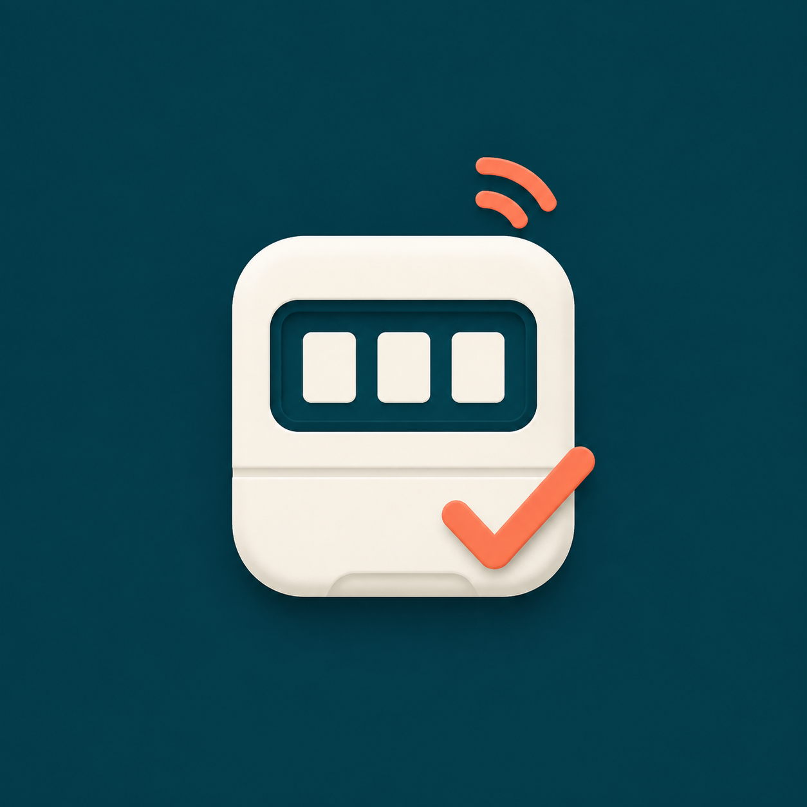
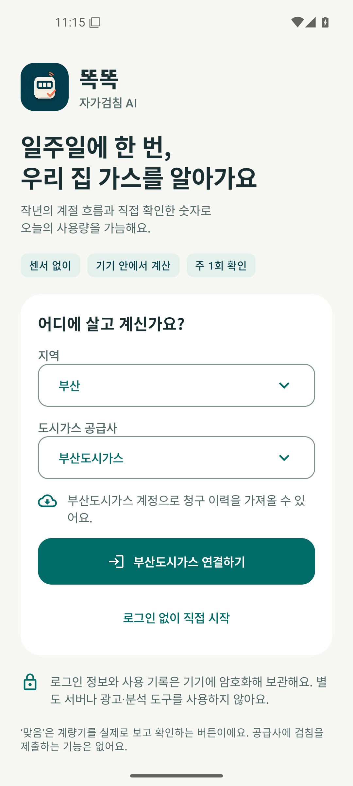
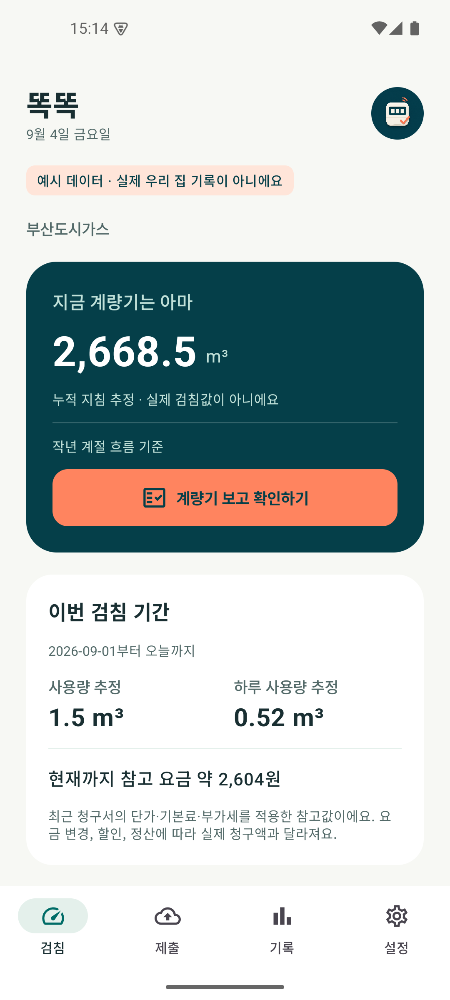
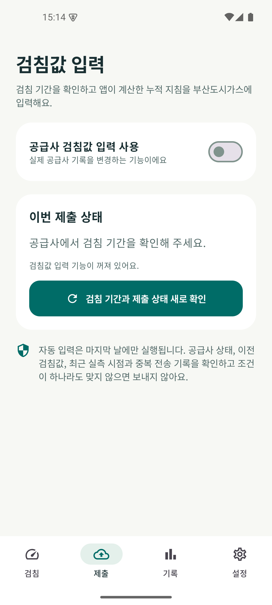
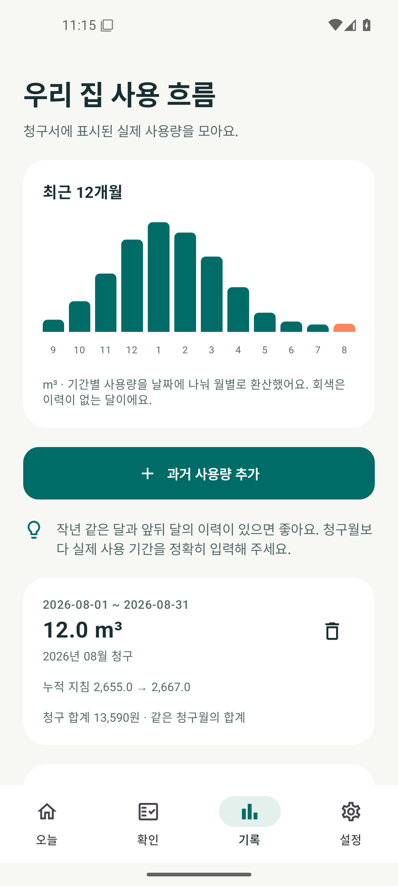
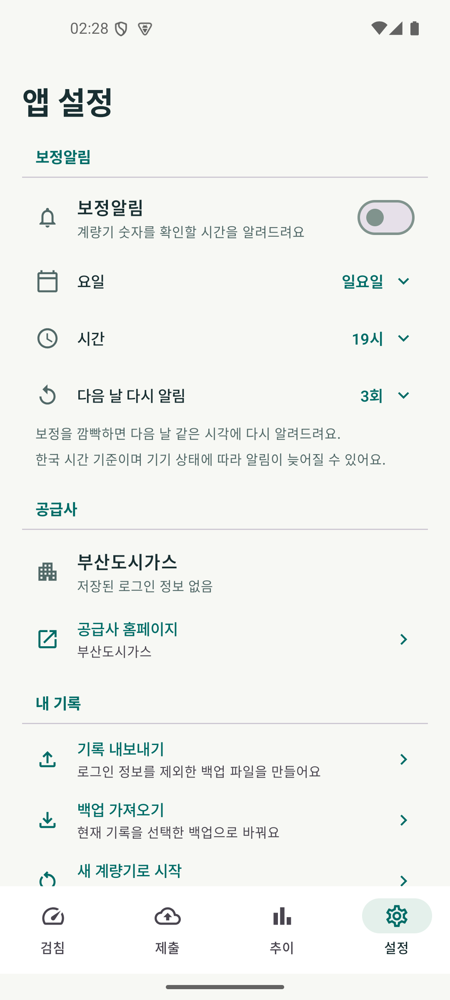

# 똑똑 자가검침 AI

**과거 사용량에 지금의 우리 집을 더해, 오늘의 가스를 똑똑하게 가늠해요.**

똑똑 자가검침 AI는 과거 도시가스 사용량과 사용자가 주기적으로 확인한 실제 계량기 숫자를 함께 반영해 현재 누적 지침과 사용량을 추정하는 Android 앱입니다. 검침 기간이 되면 확인한 값을 공급사에 직접 제출할 수 있고, 부산도시가스 이용자는 조건을 충족할 때 제출까지 자동화할 수 있습니다.

별도 센서나 카메라 촬영은 필요하지 않습니다. 일주일에 한 번 정도 계량기를 보고 실제 숫자를 알려주면, 오래된 사용 이력만으로 계산할 때보다 지금의 난방과 온수 사용 흐름에 맞게 추정을 계속 보정합니다.

[테스트 참여하기](#테스트-참여하기) · [내 공급사 지원 확인](#내-공급사에서는-어디까지-되나요) · [개인정보 안내](PRIVACY.md)

## 이렇게 사용해요

1. **과거 사용량을 준비해요.** 지원되는 공급사 계정으로 청구 이력을 가져오거나 청구서의 실제 사용 기간과 사용량을 직접 입력합니다.
2. **계량기 숫자를 가끔 확인해요.** 앱이 보여주는 추정값을 실제 계량기와 맞춰 저장합니다. 주 1회 확인을 권장하지만, 알림 요일과 시간은 직접 정할 수 있습니다.
3. **오늘의 사용량을 가늠해요.** 앱이 작년 같은 시기의 사용 흐름에 최근 실측 변화를 반영해 현재 누적 지침과 하루 사용량을 추정합니다.
4. **자가검침값을 제출해요.** 검침 기간과 제출할 숫자를 확인한 뒤 공급사에 보냅니다. 지원되는 경우 마지막 날 자동 제출을 선택할 수도 있습니다.

계정 없이 가상 데이터로 먼저 둘러볼 수 있습니다. 자동 연결을 지원하지 않는 공급사에서도 과거 사용량과 계량기 숫자를 직접 입력해 추정과 알림 기능을 사용할 수 있습니다.

## AI가 하는 일

이 앱의 AI는 대화형 AI나 계량기 사진 인식이 아닙니다. 기기 안에서 실행되는 적응형 추정 기능입니다.

- **기존 사용 흐름을 살펴요.** 작년 같은 달과 앞뒤 달의 실제 사용량으로 계절에 따른 기본 흐름을 만듭니다.
- **지금의 생활 변화를 반영해요.** 최근에 직접 확인한 계량기 숫자 두 개가 있으면 실제 사용 속도에 맞춰 기본 흐름을 보정합니다.
- **시간이 지나면 다시 조심스럽게 계산해요.** 마지막 확인이 오래될수록 최근 보정의 영향은 줄이고, 정보가 너무 부족하거나 오래되면 추정값을 숨깁니다.
- **검침 시점까지 이어줘요.** 현재 누적 지침과 사용량을 가늠하고, 검침 기간에는 사용자가 확인한 값을 공급사에 제출할 수 있게 돕습니다.

계량기를 실제로 확인할 때마다 앱은 지금의 생활 패턴을 새로 반영합니다. 날씨, 난방 방식, 거주 인원처럼 가스 사용에 영향을 주는 변화가 있어도 최근 실측이 쌓이면 다음 추정에 반영됩니다.

추정값은 실제 검침값이 아닙니다. 검침 화면에서 `계량기 보고 보정하기`를 누르고 실제 숫자를 입력하거나 `+0.1`, `−0.1`로 조정한 뒤 `이 숫자로 확인`을 눌러 저장합니다. 계량기를 직접 보고 확인해야 하며 이 동작은 공급사에 값을 제출하지 않습니다. 작년 이력이 없다면 하루 이상 간격을 둔 실측 두 번부터 최대 14일 동안 추정할 수 있습니다.

## 무엇이 편해지나요

- 지난 청구서와 최근 실측을 한곳에서 확인할 수 있습니다.
- 계량기를 확인할 요일과 시간을 정해 알림을 받을 수 있습니다.
- 이번 검침 기간의 누적 지침과 사용량을 미리 가늠할 수 있습니다.
- 예상과 실제 숫자의 차이를 보면서 우리 집의 사용 흐름을 알 수 있습니다.
- 검침 기간과 기존 제출 상태를 확인하고 같은 앱에서 자가검침값을 입력할 수 있습니다.
- 부산도시가스에서는 사용자가 정한 안전 조건을 만족할 때 마지막 날 제출을 자동화할 수 있습니다.

## 자가검침값 제출은 이렇게 보호해요

자동 제출은 처음부터 꺼져 있습니다. 사용자가 제출 탭에서 직접 켜기 전에는 앱이 검침값을 자동으로 보내지 않습니다.

직접 제출할 때는 공급사, 검침 기간과 전송할 숫자를 보여주고 마지막 확인을 받습니다. 자동 제출을 켠 경우에도 검침 기간 마지막 날에 공급사 상태를 새로 조회하고 다음 조건을 모두 확인합니다.

- 현재 계약이 자가검침 대상인지
- 지금이 공급사가 안내한 입력 기간인지
- 이미 제출된 값이 없는지
- 이전 지침보다 작은 값은 아닌지
- 최근 실측이 사용자가 정한 기간 안에 있는지
- 같은 검침 기간에 전송을 시도한 기록이 없는지

조건이 하나라도 맞지 않으면 보내지 않습니다. 전송 결과를 확정할 수 없을 때도 자동으로 다시 보내지 않고 공급사 홈페이지에서 확인하도록 안내합니다. 최근 실측 허용 기간은 1일부터 30일까지 정할 수 있으며, 사용자가 원하면 실측 시점 제한 없이 입력하도록 선택할 수도 있습니다.

## 내 공급사에서는 어디까지 되나요

같은 시·도 안에서도 주소에 따라 공급사가 다를 수 있습니다. 지역 이름만 보지 말고 청구서에 적힌 공급사 이름을 확인해 주세요.

| 공급사 | 과거 이력 자동 조회 | 앱에서 직접 제출 | 마지막 날 자동 제출 |
| --- | --- | --- | --- |
| 부산도시가스 | 지원 | 지원 | 지원 |
| 코원·충청·영남 구미·포항·전남·강원·전북에너지서비스 | 지원 | 지원 | 공급사별 검증 전까지 미지원 |
| 서울·예스코·인천 등 가스앱 14개 공급사 | 본인인증 후 지원 | 지원 | 조건부 지원 |
| 그 밖의 공급사 | 직접 입력 | 미지원 | 미지원 |

목록에 없는 공급사는 `다른 공급사 / 직접 입력`으로 시작할 수 있습니다. 여기서 직접 입력은 청구서의 사용량을 앱에 손으로 기록한다는 뜻이며 공급사 제출 기능을 뜻하지 않습니다. 이 방식에서도 사용량 추정, 실측 기록과 주간 알림을 사용할 수 있습니다. 공급사 사이트가 변경되면 자동 연결 기능도 업데이트가 필요할 수 있습니다.

현재 실제 계정으로 청구 이력 조회가 확인된 공급사는 부산도시가스입니다. 다른 SK E&S 지역 공급사는 공통 포털 구조와 공급사별 연결 주소를 확인했지만, 모든 계약에서 같은 결과를 보장하지는 않습니다. 가스앱 연결은 본인인증, 계약 조회와 제출 흐름을 구현하고 합성 응답으로 검증했습니다. 실제 계정 인증과 검침값 제출 검증은 사용자가 진행해야 합니다. [연결 범위와 검증 내용](docs/GASAPP.md)을 참고하세요.

## 추정값과 참고 요금은 어디까지 믿을 수 있나요

추정값은 다음에 계량기를 확인하기 전까지 참고하는 예상치입니다. 가구별 정확도를 보장하지 않으며 날씨, 난방 방식, 거주 인원, 온수 사용과 계량기 확인 시각에 따라 실제 숫자와 차이가 날 수 있습니다. 마지막 확인이 60일보다 오래되면 과거 이력이 있더라도 추정값을 표시하지 않습니다.

참고 요금은 최근 청구서에서 확인한 단가와 기본료를 바탕으로 계산합니다. 새로운 단가, 할인, 정산과 실제 발열량 변화를 모두 반영한 확정 청구액이 아니며 앱에서 요금을 납부할 수는 없습니다.

## 개인정보는 어디에 저장되나요

사용량, 실측 기록과 설정은 암호화해 기기에 저장합니다. 공급사 자동 연결을 선택하면 기기에서 공급사의 HTTPS 서버로 직접 로그인하고 필요한 정보를 조회합니다. 사용자가 검침값 제출을 확인하거나 자동 제출을 켠 경우에만 같은 공급사 서버로 검침값을 보냅니다.

- 개발자 서버로 계정이나 생활 기록을 보내지 않습니다.
- 외부 AI 서비스로 데이터를 보내지 않습니다.
- 광고, 사용자 추적과 자동 오류 보고 기능이 없습니다.
- 위치, 연락처, 카메라와 마이크 권한을 요청하지 않습니다.
- 로그인 정보는 사용자가 선택한 경우에만 기기에 암호화해 저장합니다.
- 내보낸 백업에는 아이디, 비밀번호와 가스앱 인증 토큰이 들어가지 않습니다.

이 앱은 도시가스 공급사가 만든 공식 앱이 아닙니다. 자세한 저장 항목과 삭제 방법은 [개인정보 안내](PRIVACY.md)에서 확인할 수 있습니다.

## 사용 전에 알아두세요

- Android 8.0 이상에서 사용할 수 있습니다.
- 현재 한 기기에서는 한 가구만 관리할 수 있습니다.
- 다른 가구로 바꾸기 전 기존 기록을 내보낸 뒤 데이터를 초기화해 주세요.
- 계량기를 교체하면 이전 실측은 보관하고 새 계량기의 현재 숫자부터 다시 시작할 수 있습니다.
- 앱을 삭제하면 기기의 암호화 키도 사라집니다. 기기를 바꾸거나 앱을 삭제하기 전에 기록을 내보내 주세요.

## 화면

아래 화면은 앱에서 생성한 가상 데이터이며 실제 고객 정보가 아닙니다.

## 테스트 참여하기

현재 Google Play Closed Alpha에서 테스트 중이며, 등록한 테스터만 설치할 수 있습니다. GitHub에서는 APK를 배포하지 않습니다.

1. Play 스토어에서 사용할 Google 계정으로 [테스터 그룹](https://groups.google.com/g/gas-self-meter-ai)에 가입합니다.
2. 같은 Google 계정으로 [테스트 참여 링크](https://play.google.com/apps/testing/dev.mahlernim.gasselfmeter)를 열고 테스터 등록을 완료합니다.
3. 등록이 반영되면 Google Play에서 앱을 설치하거나 업데이트합니다.

그룹 가입과 Play 테스터 등록은 서로 다른 단계입니다. 설치 화면이 보이지 않으면 두 단계에 같은 Google 계정을 사용했는지 확인한 뒤 잠시 후 다시 시도해 주세요. 테스트 참여 링크는 앱 등록과 첫 테스트 출시가 완료된 뒤 활성화됩니다.

## 더 자세히 알아보기

- [개인정보 안내](PRIVACY.md)
- [추정 방법과 한계](docs/ESTIMATION.md)
- [공급사 지원 조사와 검증 범위](docs/PROVIDERS.md)
- [제3자 구성요소와 출처](NOTICE.md)

앱에서 문제가 발생하면 [GitHub 오류 신고](https://github.com/mahlernim/gas-self-meter-ai/issues)에 앱 버전과 오류 상황을 적어 주세요. 공개 글에는 비밀번호, 고객번호, 청구서 원본이나 백업 파일을 올리지 마세요.

앱 소스는 [MIT 라이선스](LICENSE)로 공개합니다.

## 0.3.0 알림과 공급사 갱신

설정에서 보정 알림 뒤 다음 날 재알림을 0~6회 선택합니다. 기본은 3회이며 실제 숫자로 보정하면 해당 주기의 재알림이 멈춥니다. 제출 알림은 별도로 켜고 시각을 지정합니다. 공급사의 검침 기간에 제출 상태를 확인한 뒤 알려주며 앱 밖에서 완료한 제출도 반영합니다.

로그인 정보를 저장한 경우 하루 한 번 청구 이력, 계량기, 검침 기간과 제출 상태를 갱신합니다. 마지막 성공 조회로부터 하루가 지난 앱 실행도 갱신을 요청하며 동시에 실행된 작업은 한 번만 조회합니다. 실패하면 기존 정보를 유지합니다. 공급사 정보 갱신은 검침값을 제출하지 않습니다.

알림과 자동 갱신은 Android 백그라운드 작업으로 실행되어 절전 상태와 네트워크에 따라 지정 시각보다 늦어질 수 있습니다. 추이 화면은 최근 13개월을 기본으로 보여주고 최대 24개월을 가로로 살펴볼 수 있습니다.
